# ZeldaLike — L'Île aux trois trésors

Action-RPG 3D façon Zelda (Breath of the Wild / Link's Awakening), en low-poly coloré et cel-shadé,
réalisé avec **Godot 4.7** (GDScript) et **Blender 5.2** (modèles générés par scripts).

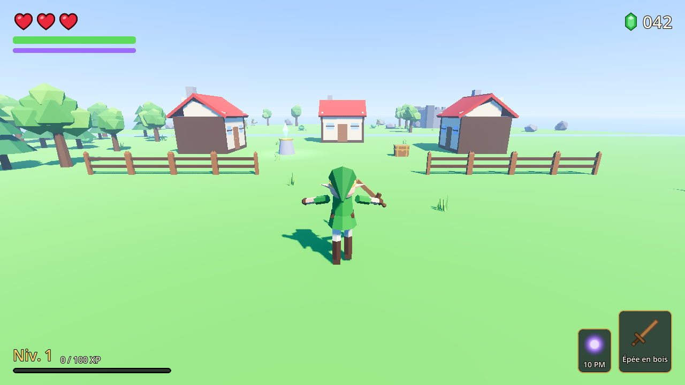

| Combat | Inventaire |
|---|---|
| 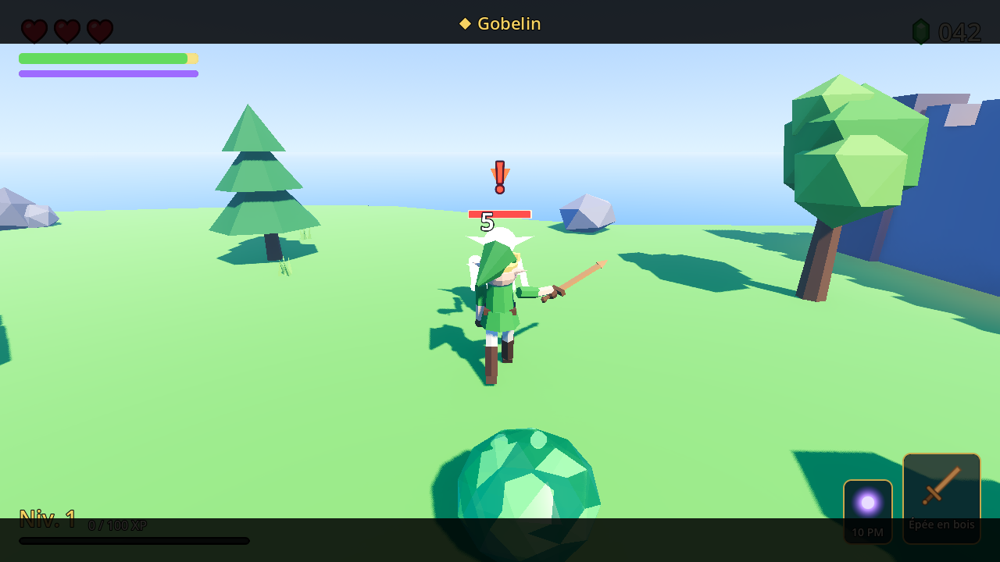 | 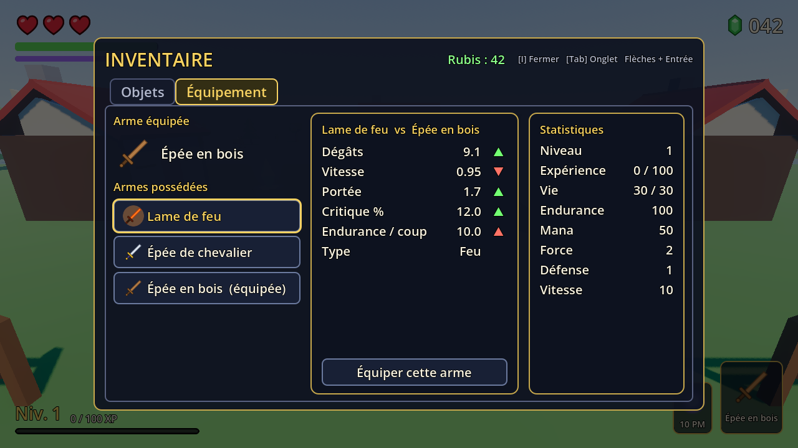 |
| **Le donjon** | **Écran titre** |
| 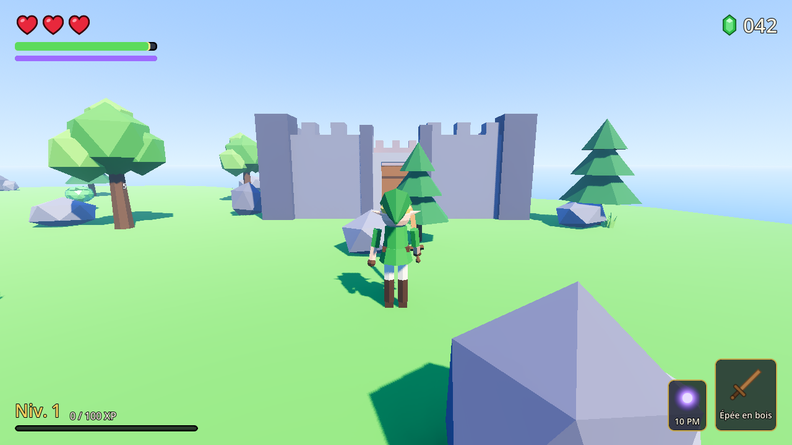 | 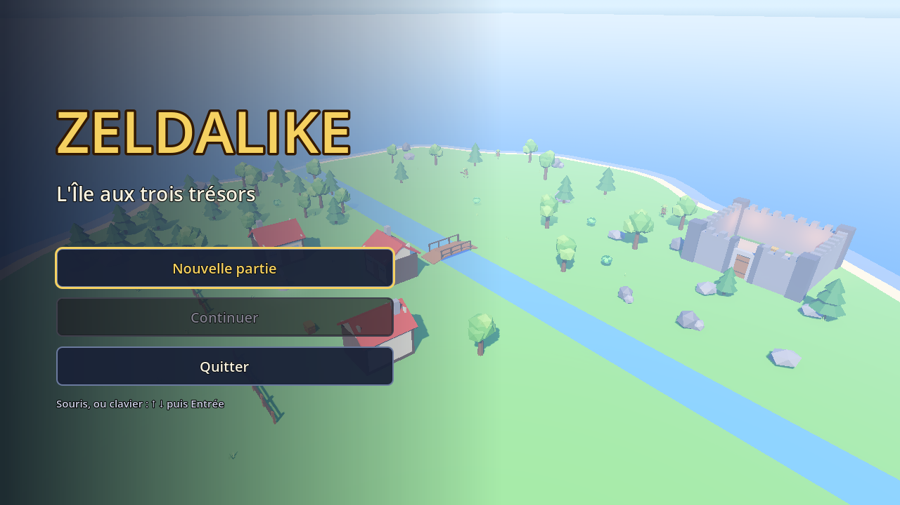 |

## La quête

Vous débarquez au sud d'une petite île. Trois trésors vous attendent :

1. **Le village** — un coffre sur la place, une statue de cristal pour sauvegarder.
2. **La forêt** (ouest) — un coffre caché renferme l'**Épée de chevalier**.
3. **Le nord**, de l'autre côté de la rivière (passez par le pont) — un coffre gardé par
   les gobelins contient la **petite clé**…
4. …qui ouvre **le donjon** (nord-est) et sa **Lame de feu**.

## Commandes

Clavier AZERTY et QWERTY (touches physiques) + souris.

| Action | Touches |
|---|---|
| Se déplacer | **Z Q S D** (AZERTY) / **W A S D** (QWERTY) ou **flèches** |
| Caméra | souris |
| Sprinter | **Maj** (consomme l'endurance) |
| Sauter | **Espace** (appui court = petit saut) |
| Roulade (invincible) | **Ctrl** ou **C** |
| Attaquer (combo de 3 coups) | **clic gauche** (cliquer pendant le coup pour enchaîner) |
| Boule d'énergie (mana) | **clic droit** |
| Verrouiller une cible | **Tab** ou **clic molette** ; **molette** pour changer de cible |
| Interagir (coffre, porte, statue) | **E** |
| Inventaire | **I** (Tab : onglet Équipement ; flèches + Entrée ou souris) |
| Pause | **Échap** |

**Graphismes** : choix **Bas / Moyen / Haut** dans l'écran titre et le menu pause (enregistré ;
Moyen par défaut). Bas convient aux petites cartes graphiques.

## Fonctionnalités

- **Déplacements** : caméra orbitale anti-collision, sprint, saut avec *coyote time* et
  mémorisation de l'appui, roulade avec invincibilité, épuisement façon BotW.
- **Combat** : combo en 3 coups (zones de coups actives uniquement pendant les frames du coup),
  3 armes, critiques, types de dégâts avec faiblesses / résistances, magie avec jauge de mana,
  *lock-on* façon Zelda, hit-stop, tremblement de caméra, recul, flash blanc, chiffres de dégâts.
- **Ennemis** : Slime (bondit) et Gobelin à massue ; patrouille, poursuite par navigation, attaques
  **annoncées** par un « ! », abandon et retour, barre de vie, butin.
- **Progression** : niveaux et XP, statistiques (Force, Défense, Vitesse…), inventaire,
  équipement avec comparaison, rubis, potions, clé.
- **Monde** : île avec village, forêt, rivière et pont, donjon à clé ; coffres et portes
  animés ; objets aspirés vers le joueur ; point de sauvegarde et réapparition.
- **Interface** : cœurs à la Zelda, jauges, inventaire, pause, écran de mort, écran titre.
- **Sons** et **particules** sur toutes les actions importantes.
- **Rendu** façon Wind Waker / BotW : cel-shading avec contours encrés, cycle jour / nuit,
  herbe et feuillage qui ondulent au vent, eau stylisée avec écume, illumination globale (SDFGI),
  brouillard volumétrique, traînées d'épée, éclairs d'impact.

## Avant / après l'amélioration visuelle

À gauche la version du jalon 8, à droite la version actuelle (qualité Haut).

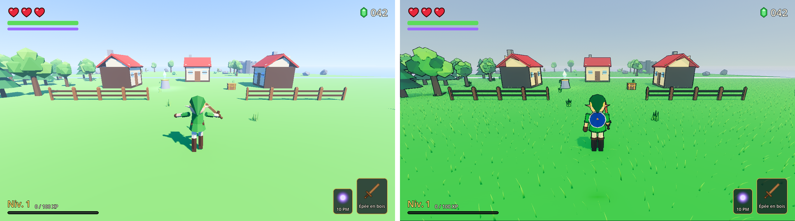
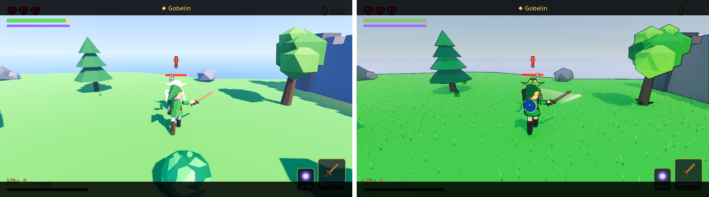
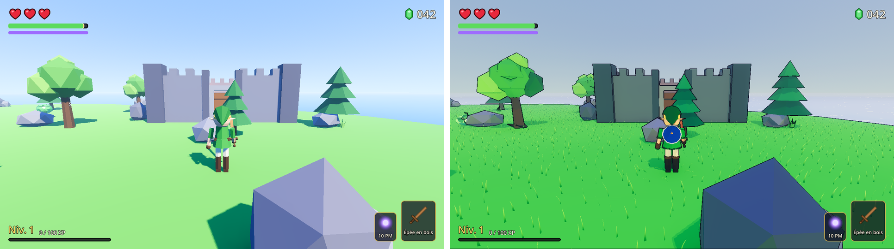
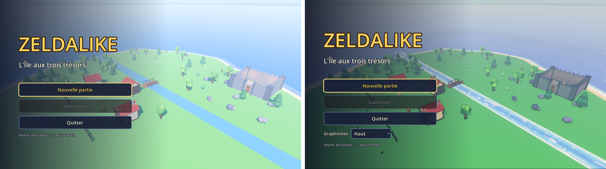

| La nuit | Qualité Bas |
|---|---|
| 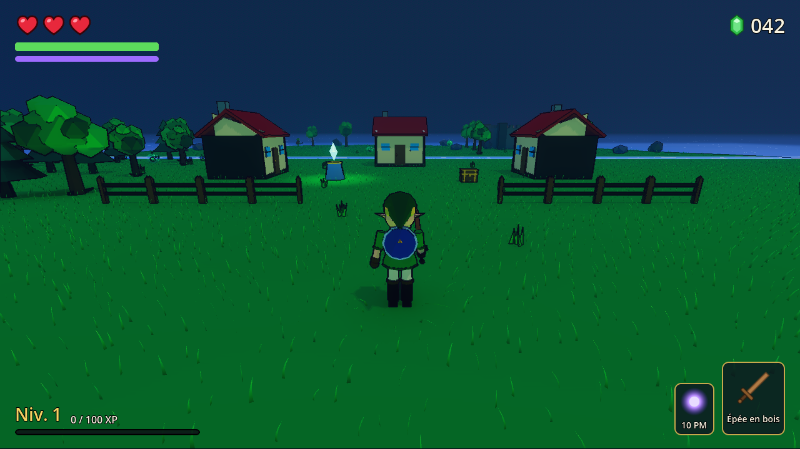 | 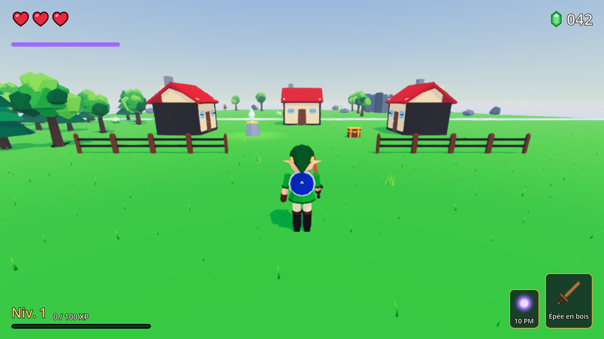 |

## Lancer le jeu

1. Installer [Godot 4.7](https://godotengine.org/) (version standard, pas .NET).
2. Ouvrir `project.godot`, puis **F5**.

## Régler l'équilibrage

Tout se règle dans l'inspecteur de Godot, sans toucher au code :

| Quoi | Où |
|---|---|
| Vitesses, saut, roulade, endurance, retour d'impact | `resources/balance/player_tuning.tres` |
| Statistiques de départ et gains par niveau | `resources/stats/player_base_stats.tres` |
| Ennemis (vie, force, défense, vitesse, XP, résistances) | `resources/stats/slime_stats.tres`, `goblin_stats.tres` |
| Comportement des ennemis (détection, portée, recharge…) | scènes `scene/enemies/slime.tscn`, `goblin.tscn` |
| Armes | `resources/weapons/*.tres` |
| Sort | `resources/spells/energy_ball.tres` |
| Objets, butin | `resources/items/*.tres`, `resources/loot_tables/*.tres` |
| Volume des sons | `resources/audio/sound_library.tres` |

## Pour les développeurs

- Architecture, conventions, pièges connus : voir [`CLAUDE.md`](CLAUDE.md).
- Tests automatiques (un par jalon) :
  `godot --headless --path . res://tests/test_jalon1.tscn` (code de sortie 0 = OK).
- Modèles 3D : scripts Python pour Blender dans `tools/blender/` (sources `.blend` dans
  `assets/blender/`).

## Crédits

- Code, modèles 3D et interface : créés pour ce projet.
- **Sons** : tous générés par synthèse (`tools/audio/generate_sounds.py`), domaine public (CC0) ;
  les petites mélodies (coffre, niveau, sauvegarde) sont des motifs originaux.
- Police : police par défaut de Godot.
- Inspiré de *The Legend of Zelda* (Nintendo) ; aucun élément original de la série n'est utilisé.
